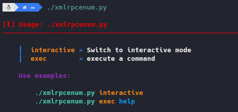

# xmlrpcenum
Herramienta en Python3 ideal para extraer información, subir archivos, etc, a una web con wordpress mediante el xmlrpc.php.

> Esta herramienta nos puede ser de mucha utilidad en los casos donde tenemos credenciales válidas de un usuario (preferiblemente administrador), pero tenemos algún impedimento para ingresar al dashboard, como lo podría ser un OTP.

Con esta utilidad podremos realizar las siguientes operaciones:
  - Subir archivos locales a la web
  - Listar los metodos disponibles
  - Extraer usuarios existentes
  - Listar los posts existentes
  - Ver el contenido de un post en 2 formatos (html, markdown)
  - Listar los links de los posts
  - Ver la estructura de los diferentes posts

## Uso
- Primero que nada, debemos cambiar algunos datos en en código (```url```, ```user```, ```password```):
<p align="center">
	
</p>

Al ejecutar la herramienta, se nos mostrará el siguiente panel de ayuda:
<p align="center">
	
</p>

Para su correcta ejecución tenemos dos opciones:
 - Modo interactivo [```interactive```]
 - Ejecutar un solo comando [```exec```]

Con el modo “```interactive```”, podremos movernos más comodamente con los comandos disponibles
<p align="center">
  
</p>

Como se nos indica al ejecutar el script, con el comando “```help```” podremos listar todos los comandos disponibles
<p align="center">
  
</p>

Como podemos ver tenemos algunos cuantos, veamos como funciona alguno.

Con “```get.postContent```”, podemos, especificando el o los IDs, ver el contenido de uno o varios posts en un formato legible (sin etiquetas html):
<p align="center">
  
</p>

Otro comando interesante es “```upload```”, con el que podremos fácilments subir a la web archivos locales:
<p align="center">
  
</p>

Como vemos, solo hay que indicarle el archivo que queramos subir (en este caso ```../file.sh```) y especificarle el nombre con el que lo queremos subir a la web (en este caso ```file.png```)

Una vez hecho esto, esta utilidad se encarga de indicarnos el id del post con el archivo subido, así como el link en donde podremos encontrarlo
<p align="center">
  
</p>

Ahora, con la opción ”```exec```“ , podremos ejecutar cualquiera de estos comandos, sin necesidad de entrar en el modo interactivo, esto en el caso de que solo necesitemos usar uno de los comandos
<p align="center">
  
</p>

**NOTA**: En un futuro se añadirán nuevas opciones a la herramienta.
